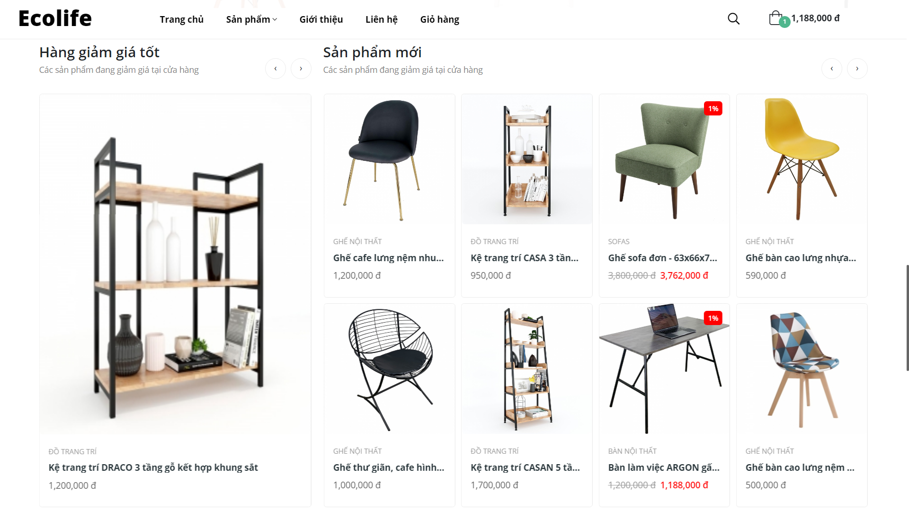
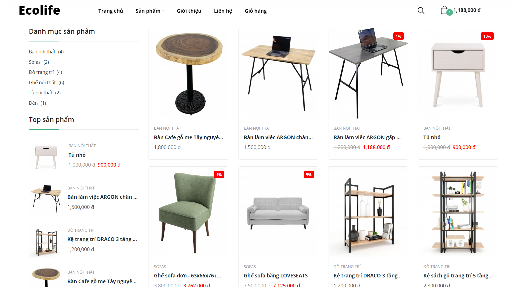
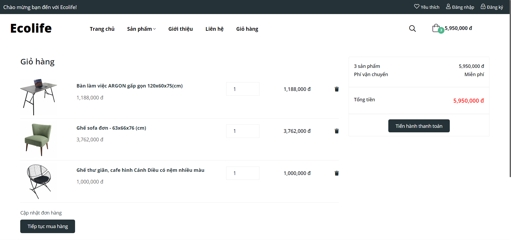
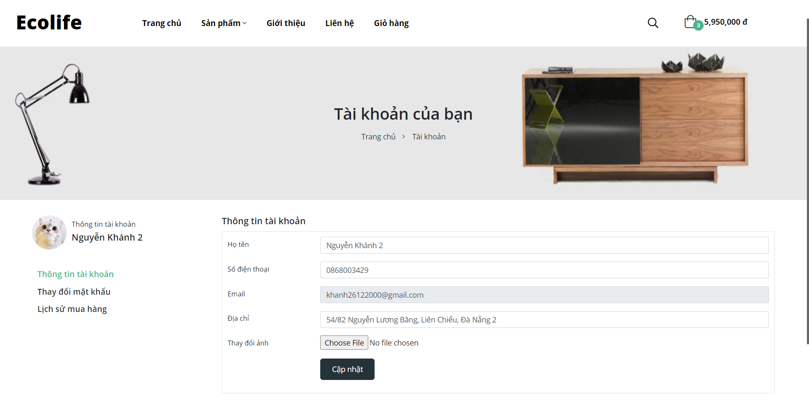
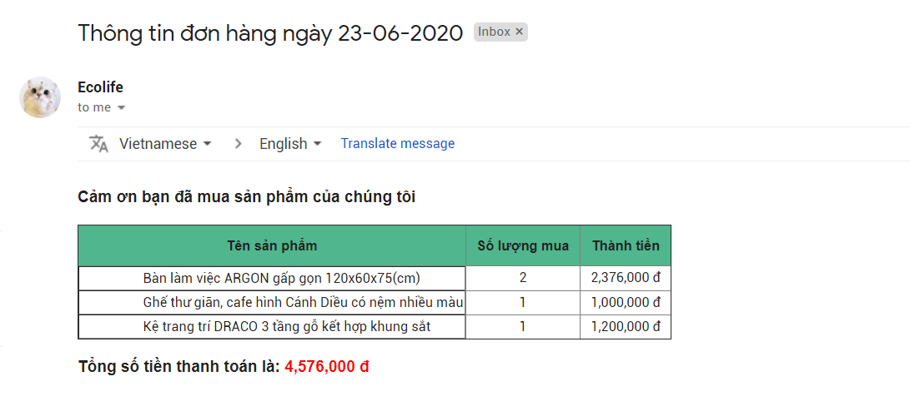

<p align="center"></p>

## Giới thiệu dự án

Project là bài tập cuối môn Laravel của trường cao đẳng FPT Polytechnic Đà Nẵng, website bán đồ nội thất.

## Công nghệ sử dụng
- Laravel
- Javascript
- Ajax
- SCSS
- Bootstrap

## Giao diện cơ bản
Giao diện trang chủ



Giao diện trang sản phẩm



Giao diện trang giỏ hàng



Giao diện trang quản lý tài khoản



Gửi mail khi mua đơn hàng



## Khởi chạy dự án

Pull project về máy, chạy file mySQL (tên database là php3_assignment), chạy dự án bằng câu lệnh, cấu hình lại email và mật khẩu trong file .env để có thể gủi mail.

> php artisan serve

Bạn đọc thêm ở trang chủ của [Laravel](https://laravel.com/docs/7.x) để biết thêm chi tiết.

## Đăng nhập vào admin

```bash
    Tên đăng nhập: khanh
    Mật khẩu: khanh1234
```


